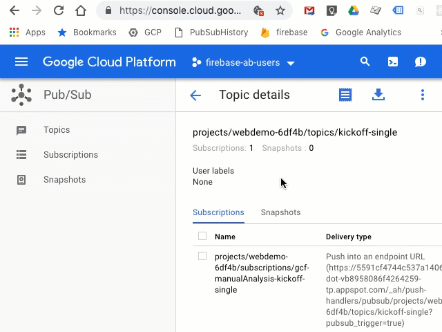

# PubSub Bookmarklet
I often invoke cloud functions that are triggered by Pub/Sub directly in the GCP UI, either for testing or for kicking off manual report generation. I don't want to type out the payload each time, so this bookmarklet pulls up the last payload from LocalStorage. Each Pub/Sub topic gets its own key/value pair.



Host the script pubsub_history.js on a CDN and create a bookmark


with the following URL:

```
javascript:(function()%7Bdocument.body.appendChild(document.createElement(%27script%27)).src%3D%27https://sep.yimg.com/ty/cdn/test-prod-st75-monitus/pubsubpast.js%27%3B%7D)()%3B
```